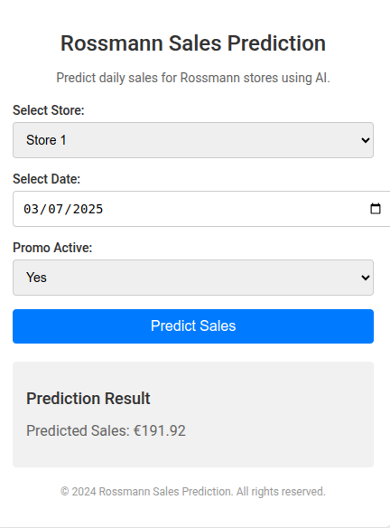

# Rossmann Pharmaceuticals Sales Forecasting



## Project Overview

This project aims to forecast sales for Rossmann Pharmaceuticals stores across several cities six weeks ahead of time. The finance team relies on these forecasts to make informed decisions. The project involves building and serving an end-to-end product that delivers these predictions to analysts in the finance team.

## Data Sources

The following datasets are used in this project:
- `sample_submission.csv`
- `store.csv`
- `test.csv`
- `train.csv`

## Notebooks

- `Exploration_of_customer_behavior.ipynb`: Contains exploratory data analysis (EDA) for understanding customer purchasing behavior, including data cleaning, visualization, and analysis of various factors affecting sales.

## Scripts

The `scripts` directory contains the following Python scripts used for different analyses:

- `data_cleaning.py`: Handles missing data and outliers.
- `correlation.py`: Analyzes the correlation between sales and the number of customers.
- `effect_of_promotions.py`: Analyzes the effect of promotions on sales.
- `effectiveness_of_promotions.py`: Determines the effectiveness of promotions.
- `customer_behavior.py`: Analyzes customer behavior during store opening and closing times.
- `average_sale_on_weekend.py`: Analyzes average sales on weekends.
- `effect_of_assortment.py`: Analyzes the effect of assortment type on sales.
- `effect_of_distance.py`: Analyzes the effect of distance to competitors on sales.
- `sales_behavior_during_holidays.py`: Analyzes sales behavior during holidays.
- `seasonal_purchase_behaviors.py`: Analyzes seasonal purchase behaviors.

## Task 2: Predictive Modeling

- `model_training.py`: Builds and trains machine learning models (Linear Regression, Decision Trees, Random Forests) for sales prediction.
- `model_evaluation.py`: Evaluates the performance of trained models using metrics such as RMSE and R2 score.
- `hyperparameter_tuning.py`: Optimizes model performance through hyperparameter tuning.

## Task 3: Deployment

- `app.py`: Contains the Flask application for serving predictions via a REST API.
- `requirements.txt`: Lists the dependencies required to run the application.
- `Dockerfile`: Defines the Docker container for deploying the application.
- `api_integration_tests.py`: Tests the functionality and reliability of the REST API.

## Installation

1. Clone the repository:
    ```sh
    git clone https://github.com/teddyhabtamu/Kifiya-AIM-Week-4.git
    cd Kifiya-AIM-Week-4
    ```

2. Create and activate a virtual environment:
    ```sh
    python -m venv .venv
    source .venv/bin/activate  # On Windows use `.venv\Scripts\activate`
    ```

3. Install the required packages:
    ```sh
    pip install -r requirements.txt
    ```

## Usage

### Data Analysis and Modeling
1. Navigate to the `notebooks` directory and open `Exploration_of_customer_behavior.ipynb`.
2. Run the cells to perform data cleaning, exploratory data analysis, and visualization.
3. Use the scripts in the `scripts` directory for advanced analysis and model training.

### API Deployment
1. Build and run the Docker container:
    ```sh
    docker build -t rossmann-forecast .
    docker run -p 5000:5000 rossmann-forecast
    ```
2. Access the API at `http://localhost:5000/predict`.

## Logging

The project uses the `logging` library for traceability and reproducibility. Logs are generated during the execution of scripts and notebook cells to provide insights into the steps performed and any issues encountered.

## Contributing

Contributions are welcome! Please feel free to submit a Pull Request.

## License

This project is licensed under the MIT License.

